# Cyphar

<div align="center">

**Production-Grade FHEVM Example Hub with Intelligent Automation**

[](LICENSE)
[](https://github.com/zama-ai/fhevm)
[](#available-examples)
[](https://www.typescriptlang.org/)

*A comprehensive system for creating standalone FHEVM example repositories with automated documentation generation and intelligent tooling*

[Features](#-features) • [Quick Start](#-quick-start) • [Examples](#-available-examples) • [Architecture](#-architecture) • [Documentation](#-documentation)

</div>

---

## 📊 Project Overview

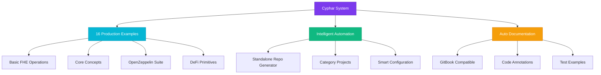

## 🎯 What Makes Cyphar Special

Cyphar isn't just another example repository. It's a **production-grade automation system** designed to:

- ⚡ **Generate standalone repos** in seconds with one command
- 🏗️ **Intelligent scaffolding** that understands contract structure
- 📚 **Auto-generate documentation** from code annotations
- 🔧 **Production-ready** OpenZeppelin confidential contracts
- 🎓 **Educational focus** with anti-patterns and best practices
- 🚀 **Future-proof** architecture for easy maintenance

---

## 🌟 Features

### 🤖 Intelligent Automation

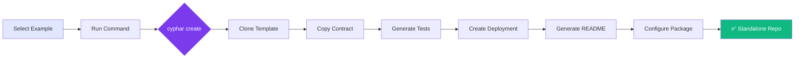

### 📦 Category-Based Projects

Generate multi-contract repositories by category:

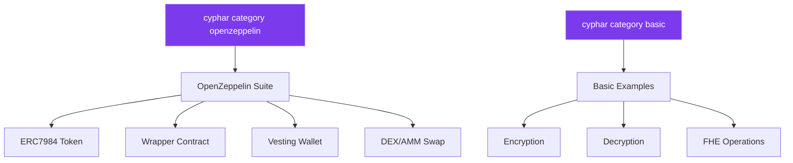

### 📖 Auto Documentation

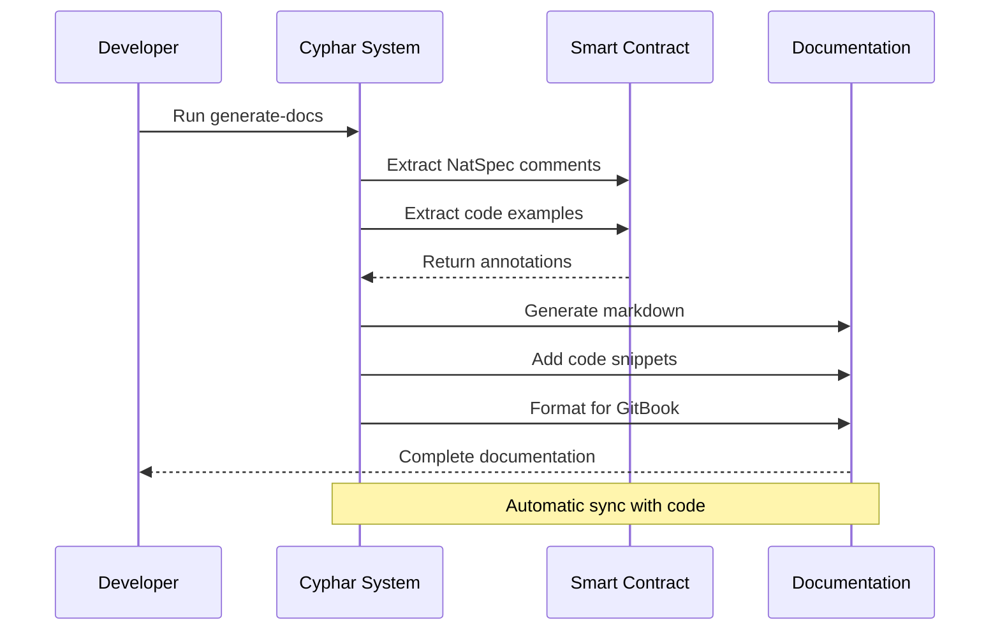

---

## 🚀 Quick Start

### Prerequisites

- Node.js >= 20
- npm >= 7.0.0

### Installation

```bash
# Clone the repository
git clone https://github.com/[username]/cyphar.git
cd cyphar

# Install dependencies
npm install
```

### Generate Your First Example

```bash
# Create a standalone ERC7984 confidential token example
npm run create-example erc7984-example ./my-confidential-token

# Navigate to the generated project
cd my-confidential-token

# Install and run
npm install
npm run compile
npm run test
```

### Generate a Category Project

```bash
# Generate all OpenZeppelin examples in one project
npm run create-category openzeppelin ./oz-examples

cd oz-examples
npm install
npm test
```

### Generate Documentation

```bash
# Generate docs for a specific example
npm run generate-docs access-control

# Generate docs for all examples
npm run generate-all-docs
```

---

## 📚 Available Examples

### 🔰 Basic Examples (7)

Foundation FHE operations and patterns:

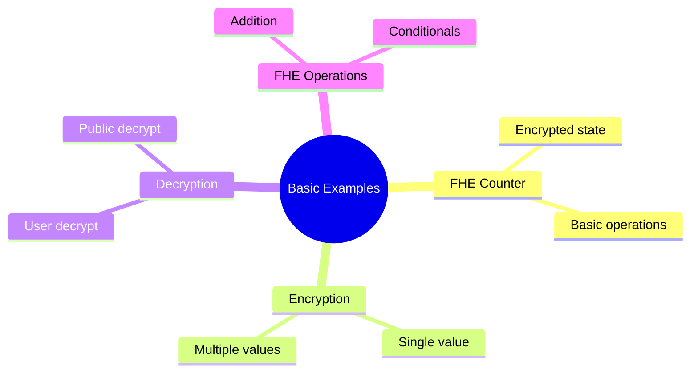

| Example | Description |
|---------|-------------|
| `fhe-counter` | Simple encrypted counter with basic FHE operations |
| `encrypt-single-value` | Encryption mechanism and common pitfalls |
| `encrypt-multiple-values` | Handling multiple encrypted values |
| `user-decrypt-single-value` | User decryption with permissions |
| `user-decrypt-multiple-values` | Decrypting multiple values |
| `fhe-add` | FHE addition operations |
| `fhe-if-then-else` | Conditional operations on encrypted values |

### 🎓 Core Concepts (3)

**NEW:** Comprehensive educational examples:

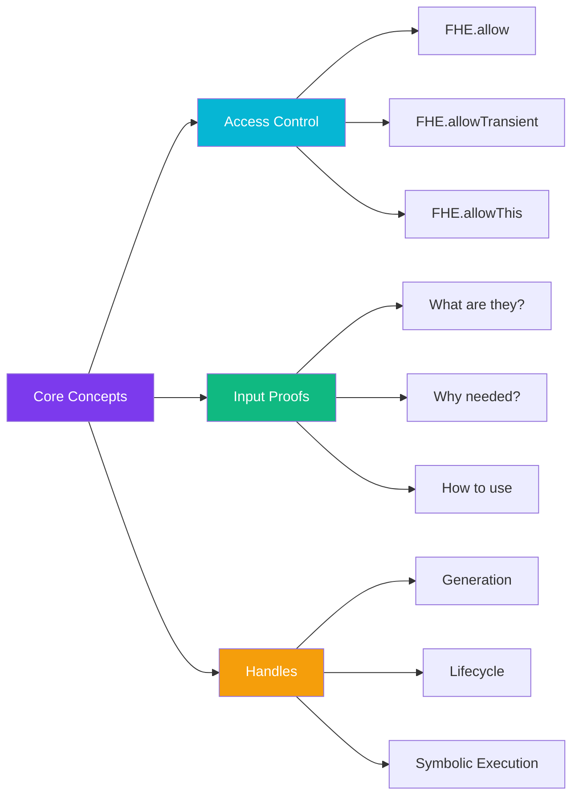

| Example | Description |
|---------|-------------|
| `access-control` | FHE access control patterns (allow, allowTransient, allowThis) |
| `input-proof` | Complete guide to input proofs and their security role |
| `handles` | Understanding encrypted handles and symbolic execution |

### 🏆 OpenZeppelin Suite (4)

Production-ready confidential contracts:

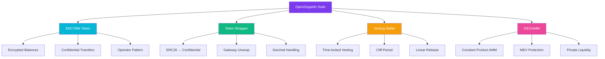

| Example | Description |
|---------|-------------|
| `erc7984-example` | ERC7984 confidential token standard implementation |
| `erc7984-wrapper` | Wrap/unwrap ERC20 ↔ ERC7984 with gateway decryption |
| `vesting-wallet-confidential` | Time-locked token vesting with cliff and factory |
| `confidential-swap` | Privacy-preserving AMM for confidential token swaps |

### 🎯 Advanced Examples (2)

| Example | Description |
|---------|-------------|
| `blind-auction` | Sealed-bid auction with confidential bids |
| `confidential-dutch-auction` | Dutch auction with encrypted price discovery |

---

## 🏗️ Architecture

### System Architecture

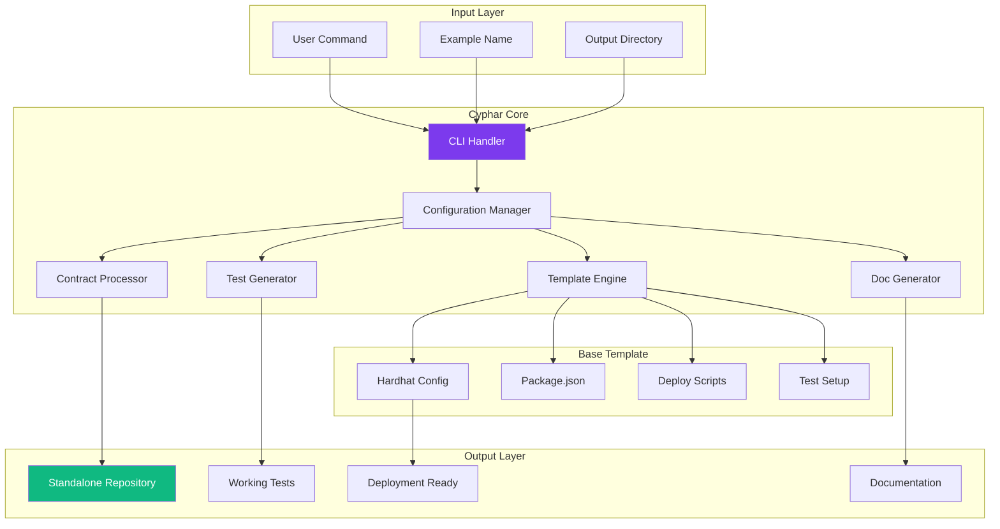

### Automation Workflow

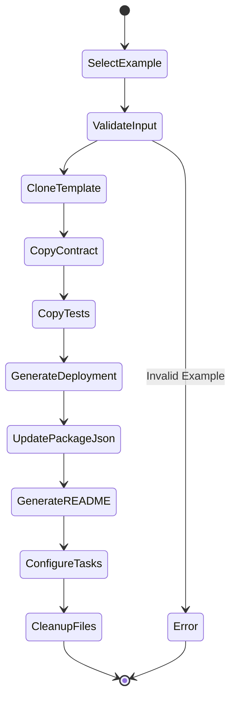

### Data Flow

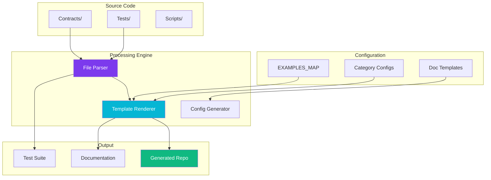

---

## 📖 Project Structure

```
cyphar/
├── 📁 fhevm-hardhat-template/    # Base Hardhat template
│   ├── contracts/                 # Template contracts
│   ├── test/                      # Template tests
│   ├── deploy/                    # Deployment scripts
│   └── hardhat.config.ts          # Hardhat configuration
│
├── 📁 contracts/                  # All example contracts
│   ├── basic/                     # Basic FHE operations
│   │   ├── FHECounter.sol
│   │   ├── AccessControlExample.sol
│   │   ├── InputProofExample.sol
│   │   ├── HandlesExample.sol
│   │   ├── encrypt/               # Encryption examples
│   │   ├── decrypt/               # Decryption examples
│   │   └── fhe-operations/        # FHE operators
│   │
│   ├── openzeppelin/              # OpenZeppelin suite
│   │   ├── ERC7984Example.sol
│   │   ├── ERC7984WrapperExample.sol
│   │   ├── VestingWalletConfidentialExample.sol
│   │   └── ConfidentialSwapExample.sol
│   │
│   └── auctions/                  # Auction examples
│
├── 📁 test/                       # All test files (mirrors contracts/)
│   ├── basic/
│   ├── openzeppelin/
│   └── auctions/
│
├── 📁 scripts/                    # Automation tools
│   ├── create-fhevm-example.ts    # Standalone repo generator
│   ├── create-fhevm-category.ts   # Category project generator
│   └── generate-docs.ts           # Documentation generator
│
├── 📁 docs/                       # Generated documentation
│   ├── SUMMARY.md                 # GitBook index
│   └── *.md                       # Individual example docs
│
└── 📁 openzeppelin-confidential-contracts/  # OZ reference
```

---

## 🔧 Configuration

### Example Configuration

All examples are defined in `scripts/create-fhevm-example.ts`:

```typescript
const EXAMPLES_MAP: Record<string, ExampleConfig> = {
  'erc7984-example': {
    contract: 'contracts/openzeppelin/ERC7984Example.sol',
    test: 'test/openzeppelin/ERC7984Example.ts',
    description: 'ERC7984 confidential token standard implementation',
  },
  // ... 15 more examples
};
```

### Category Configuration

Categories are defined in `scripts/create-fhevm-category.ts`:

```typescript
const CATEGORIES: Record<string, CategoryConfig> = {
  openzeppelin: {
    name: 'OpenZeppelin Confidential Contracts',
    description: 'Production-grade confidential token implementations',
    contracts: [
      { path: 'contracts/openzeppelin/ERC7984Example.sol', ... },
      { path: 'contracts/openzeppelin/ERC7984WrapperExample.sol', ... },
      // ... more contracts
    ],
  },
};
```

---

## 💻 Usage Examples

### Basic Usage

```bash
# Generate single example
npm run create-example access-control ./my-access-control-example

# Generate category project
npm run create-category basic ./basic-examples

# Generate documentation
npm run generate-docs access-control
```

### Advanced Usage

```bash
# Create multiple examples at once
for example in access-control input-proof handles; do
  npm run create-example $example ./examples/$example
done

# Generate all documentation
npm run generate-all-docs

# Test an example before generation
cd fhevm-hardhat-template
cp ../contracts/basic/AccessControlExample.sol contracts/
cp ../test/basic/AccessControlExample.ts test/
npm test
```

---

## 🧪 Testing

### Test Coverage

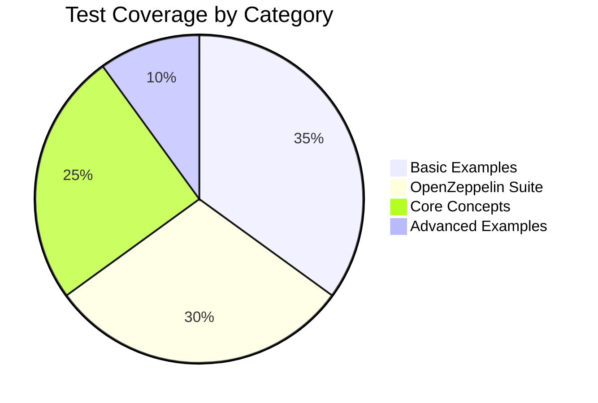

### Running Tests

```bash
# Run all tests
npm test

# Run specific test
npm test test/basic/AccessControlExample.ts

# Run with coverage
npm run coverage
```

### Test Structure

Each test file includes:
- ✅ **Success cases** - Correct usage patterns
- ❌ **Failure cases** - Common mistakes and edge cases
- 🎭 **Privacy tests** - Verify encryption/decryption
- 📖 **Educational examples** - Learning through tests

---

## 📚 Documentation

### Auto-Generation

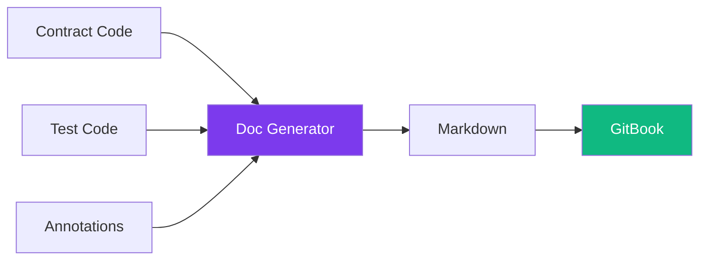

### Documentation Features

- 📝 **Auto-generated** from code comments
- 🏷️ **Categorized** by topic
- 💡 **Code examples** with syntax highlighting
- ⚠️ **Anti-patterns** clearly marked
- 🔗 **Cross-referenced** between examples

---

## 🛠️ Maintenance

### Updating All Examples

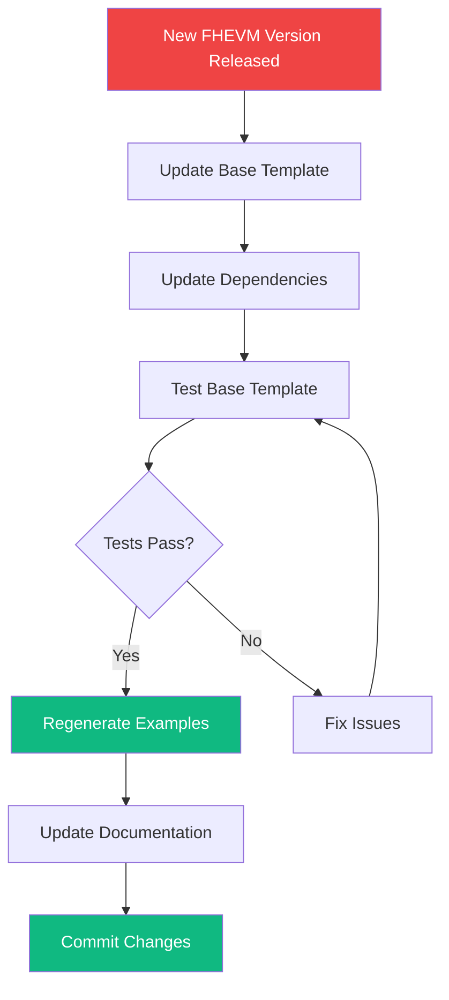

### Adding New Examples

1. **Create Contract**: Add to `contracts/` directory
2. **Create Tests**: Add to `test/` directory
3. **Update Config**: Add entry to `EXAMPLES_MAP`
4. **Generate Docs**: Run `generate-docs.ts`
5. **Test Generation**: Run `create-fhevm-example.ts`

---

## 🎓 Learning Path

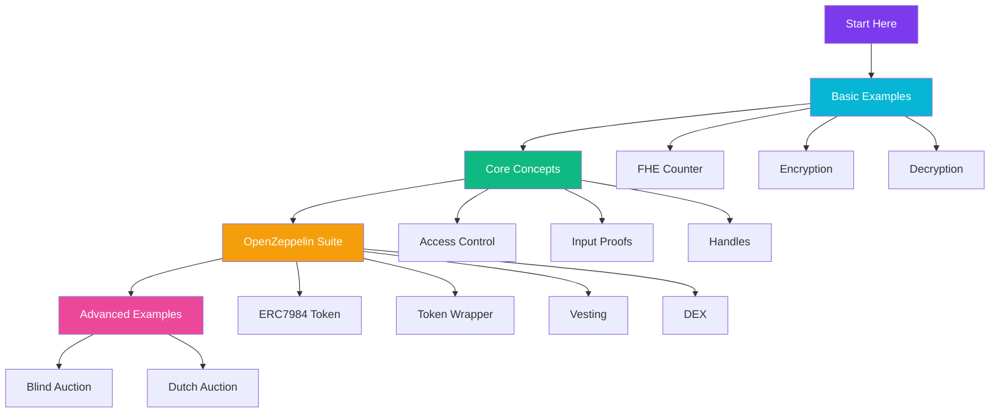

---

## 🤝 Contributing

We welcome contributions! Please follow these steps:

1. Fork the repository
2. Create your feature branch (`git checkout -b feature/AmazingFeature`)
3. Add your example to the appropriate directory
4. Update `EXAMPLES_MAP` configuration
5. Generate documentation
6. Test standalone repo generation
7. Commit your changes (`git commit -m 'Add AmazingFeature'`)
8. Push to the branch (`git push origin feature/AmazingFeature`)
9. Open a Pull Request

---

## 📊 Statistics

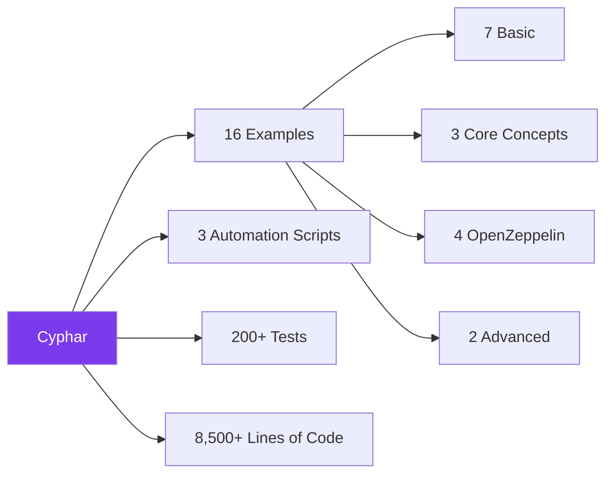

| Metric | Count |
|--------|-------|
| Total Examples | 16 |
| Test Cases | 200+ |
| Lines of Code | 8,500+ |
| Automation Scripts | 3 |
| Documentation Pages | 16+ |
| Categories | 4 |

---

## 🔗 Resources

- **FHEVM Documentation**: https://docs.zama.ai/fhevm
- **Protocol Examples**: https://docs.zama.org/protocol/examples
- **Base Template**: https://github.com/zama-ai/fhevm-hardhat-template
- **OpenZeppelin Confidential**: https://github.com/OpenZeppelin/openzeppelin-confidential-contracts
- **Zama Community**: https://discord.com/invite/zama

---

## 📜 License

This project is licensed under the BSD-3-Clause-Clear License - see the [LICENSE](LICENSE) file for details.

---

## 🙏 Acknowledgments

- **Zama Team** for FHEVM and the bounty program
- **OpenZeppelin** for confidential contracts library
- **Community Contributors** for feedback and examples

---

## 📞 Support

- **Issues**: [GitHub Issues](https://github.com/[username]/cyphar/issues)
- **Discussions**: [GitHub Discussions](https://github.com/[username]/cyphar/discussions)
- **Discord**: [Zama Discord](https://discord.com/invite/zama)

---

<div align="center">

**Built with ❤️ for the FHEVM Community**

⭐ Star this repo if Cyphar helps your FHEVM development!

[Get Started](#-quick-start) • [View Examples](#-available-examples) • [Read Docs](#-documentation)

</div>
